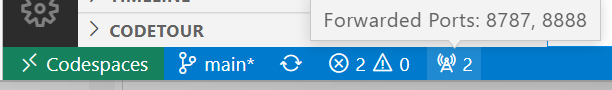
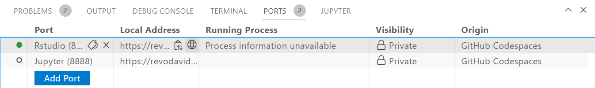

# Opening a Virtual Environment for ATSA-ES Content

Click the green "<> Code" button at the top right on this repository page, and then select "Create codespace on main".

To open RStudio Server, click the Forwarded Ports "Radio" icon at the bottom of the VS Code Online window.

In the Ports tab, click the Open in Browser "World" icon that appears when you hover in the "Local Address" column for the Rstudio row.

This will launch RStudio Server in a new window. Log in with the username and password `rstudio/rstudio`. 

* NOTE: Sometimes, the RStudio window may fail to open with a timeout error. If this happens, try again, or restart the Codepace.

In RStudio, use the File menu to open the `/workspaces`, folder and then browse to open the file `fish550-devcontainers-rstudio`.

## To use this devcontainer for your own repos

* Fork or clone the repo
* Open a codespace on your repo
* Before you open RStudio Server, click the Git icon on left and sync. This will set up Git so that RStudio Server can do pushes and pulls.

## Credits

This is a fork of https://github.com/revodavid/devcontainers-rstudio
